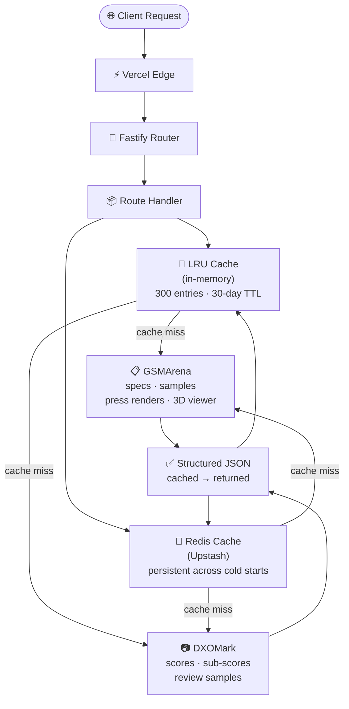

<div align="center">

<!-- HERO BANNER — replace with your actual banner (recommended: 1280×320px, dark background) -->


# 📡 GSMArena + DXOMark Mobile Specs API

### The only open-source API that fuses hardware specs, professional camera scores, and categorized camera samples — in a single request.

[](./LICENSE)
[](https://www.typescriptlang.org/)
[](https://nodejs.org/)
[](https://fastify.dev/)
[](https://pnpm.io/)
[](https://vercel.com/)
[](../../actions)

<br/>

[🚀 Deploy Now](#deploy-to-vercel) · [📖 API Reference](#api-reference) · [⚡ Quick Start](#quick-start) · [🐛 Report Bug](../../issues) · [💡 Request Feature](../../issues)

</div>

---

## Table of Contents

- [Why This API?](#why-this-api)
- [Features](#features)
- [Quick Start](#quick-start)
  - [Deploy to Vercel](#deploy-to-vercel)
  - [Running Tests](#running-tests)
- [Environment Variables](#environment-variables)
- [API Reference](#api-reference)
  - [Endpoint Overview](#endpoint-overview)
  - [`/phone` — Full device data ⭐](#phone--full-device-data-in-one-call-)
  - [`/search` — Device search](#search--device-search)
  - [`/:slug` — Specs by slug](#slug--specs-by-gsmarena-slug)
  - [`/brands` — All brands](#brands--all-brands)
  - [`/brands/:brandSlug` — Phones by brand](#brandsbrandslug--phones-by-brand)
  - [`/latest` — Latest phones](#latest--latest-phones)
  - [`/top-by-interest` · `/top-by-fans`](#top-by-interest--top-by-fans--trending-devices)
  - [`/review/:reviewSlug` — Full review](#reviewreviewslug--full-review)
  - [`/review/:reviewSlug/camera-samples`](#reviewreviewslugcamera-samples--camera-samples-only)
  - [`/review/:reviewSlug/images`](#reviewreviewslugimages--in-article-images)
  - [DXOMark Endpoints](#dxomark-endpoints)
  - [Cache Behaviour](#cache-behaviour)
  - [Error Responses](#error-responses)
- [Sample JSON Output](#sample-json-output)
- [Architecture](#architecture)
- [Project Structure](#project-structure)
- [Use Cases](#use-cases)
- [Performance](#performance)
- [Contributing](#contributing)
- [Roadmap](#roadmap)
- [Disclaimer](#%EF%B8%8F-disclaimer)
- [License](#license)

---

## Why This API?

Most GSMArena scrapers are **table-only tools** — they grab the spec sheet and stop. They return raw strings like `"200 MP, f/1.7"` with no signal on whether that sensor actually *performs* in the real world.

This API is different. It answers the question developers actually need to ask:

> *"How does this phone's hardware translate into real-world camera performance?"*

It does this by combining three things no other open-source scraper provides in one call:

1. **Full GSMArena specifications** — every field, clean structured JSON
2. **DXOMark professional scores** — overall, photo, video, zoom, bokeh, selfie, audio, display, battery, with `BEST` values per sub-score
3. **Intelligently categorized camera samples** — not a flat image dump, but samples sorted by shooting condition and sensor mode (including isolated high-resolution shots vs. standard pixel-binned output)

It also surfaces **official press renders per color variant**, **in-article review images**, and the **GSMArena 3D viewer URL** — everything a comparison app or review site needs in a single request.

<div align="right"><a href="#table-of-contents">↑ back to top</a></div>

---

## Features

| Feature | This API | Most others |
|:---|:---:|:---:|
| DXOMark overall score | ✅ | ❌ |
| DXOMark sub-scores (photo, video, zoom, bokeh, selfie…) | ✅ | ❌ |
| DXOMark `BEST` values per sub-score | ✅ | ❌ |
| Camera samples by shooting condition | ✅ | ❌ |
| High-res (200MP) vs. binned sample isolation | ✅ | ❌ |
| Official press renders per color variant | ✅ | ❌ |
| GSMArena 3D viewer URL | ✅ | ❌ |
| Smart search with penalty scoring | ✅ | ❌ |
| In-memory LRU + Redis two-layer cache | ✅ | ❌ |
| Full DXOMark review (pros, cons, strengths, weaknesses) | ✅ | ❌ |
| Latest phones & top-by-interest/fans lists | ✅ | ❌ |
| Serverless-ready — zero infrastructure | ✅ | ❌ |

<div align="right"><a href="#table-of-contents">↑ back to top</a></div>

---

## Quick Start

**Prerequisites:** Node.js 18+ · pnpm

```bash
git clone https://github.com/Sanjeevu-Tarun/gsmarena-dxomark-mobile-specs-api
cd gsmarena-dxomark-mobile-specs-api
pnpm install
pnpm dev
# → http://localhost:4000
```

### Deploy to Vercel

[](https://vercel.com/new/clone?repository-url=https://github.com/Sanjeevu-Tarun/gsmarena-dxomark-mobile-specs-api)

Or via CLI:

```bash
npm install -g vercel
vercel deploy
```

`vercel.json` is pre-configured. Zero extra setup required.

### Running Tests

```bash
pnpm test
```

The test suite covers route handlers, cache layer behaviour (`mem` / `redis` / `miss`), search penalty scoring, and DXOMark score parsing. All tests run against a local mock server — no live scraping occurs during CI.

<div align="right"><a href="#table-of-contents">↑ back to top</a></div>

---

## Environment Variables

The API runs without any configuration. Redis is optional — without it, only the in-memory LRU layer is active.

| Variable | Required | Description |
|:---|:---:|:---|
| `UPSTASH_REDIS_REST_URL` | No | Upstash Redis REST endpoint |
| `UPSTASH_REDIS_REST_TOKEN` | No | Upstash Redis auth token |

> **Note:** Without Redis, cached data does not survive Vercel cold starts. For production use, a Redis instance is strongly recommended. Get one free at [console.upstash.com](https://console.upstash.com).

<div align="right"><a href="#table-of-contents">↑ back to top</a></div>

---

## API Reference

### Endpoint Overview

A quick reference before diving into individual endpoints.

| Method | Endpoint | Description |
|:---|:---|:---|
| `GET` | `/phone?name=` | ⭐ Full device data — specs + DXOMark + samples |
| `GET` | `/search?query=` | Search devices by name |
| `GET` | `/:slug` | Raw specs by GSMArena slug |
| `GET` | `/brands` | All brands |
| `GET` | `/brands/:brandSlug` | All phones for a brand |
| `GET` | `/latest` | Recently released devices |
| `GET` | `/top-by-interest` | Trending by interest ranking |
| `GET` | `/top-by-fans` | Trending by fans ranking |
| `GET` | `/review/:reviewSlug` | Full review (hero + images + samples + lenses) |
| `GET` | `/review/:reviewSlug/camera-samples` | Camera samples only, pre-sorted |
| `GET` | `/review/:reviewSlug/images` | In-article images grouped by heading |
| `GET` | `/dxomark?name=` | DXOMark scores + categorized samples |
| `GET` | `/dxomark/review?name=` | Full DXOMark review with `BEST` values |
| `GET` | `/dxomark/review/samples?name=` | DXOMark sample images only |
| `GET` | `/dxomark/review/url?url=` | Scrape a specific DXOMark review URL |
| `GET` | `/dxomark/search?query=` | Search DXOMark directly |
| `GET` | `/dxomark/url?name=` | Resolve DXOMark URL for a device name |

All endpoints that accept a `name` or `query` parameter also accept `&nocache=1` to bypass both cache layers and force a fresh scrape.

---

### `/phone` — Full device data in one call ⭐

The primary endpoint. Returns specs + camera samples + press renders + DXOMark scores in a single request.

**Query Parameters**

| Parameter | Required | Description |
|:---|:---:|:---|
| `name` | Yes | Device name (URL-encoded, e.g. `samsung+galaxy+s25+ultra`) |
| `nocache` | No | Set to `1` to skip both cache layers and force a live scrape |

```bash
GET /phone?name=samsung+galaxy+s25+ultra
GET /phone?name=pixel+9+pro&nocache=1
```

**Response shape:**

```jsonc
{
  "status": true,
  "matched": "Samsung Galaxy S25 Ultra",
  "_cache": "redis",           // "mem" | "redis" | "miss" — which layer served this response
  "_cameraFound": true,
  "data": {
    "model": "...",
    "release_date": "...",
    "dimensions": "...",
    "os": "...",
    "storage": "...",
    "review_url": "https://www.gsmarena.com/...",
    "hdImageUrl": "https://fdn.gsmarena.com/imgroot/...",   // full-res review hero
    "specifications": { "Platform": { "Chipset": "..." }, ... },
    "device_images": [{ "color": "Titanium Black", "url": "..." }],
    "colorVariants": [{ "colorName": "...", "imageUrl": "...", "isDefault": true }],
    "officialImages": ["https://fdn2.gsmarena.com/vv/pics/..."],  // all press renders
    "picturesPageUrl": "https://www.gsmarena.com/...-pictures-NNNNN.php",
    "cameraSamples": [
      {
        "label": "Zoom — 5x",
        "images": [{ "category": "Zoom — 5x", "url": "...", "caption": "115mm, f/2.9, ISO 50, 1/466s" }]
      }
    ],
    "lensDetails": [{ "role": "Wide (main)", "detail": "50MP, f/1.7, OIS, 4K@120fps" }]
  }
}
```

---

### `/search` — Device search

**Query Parameters**

| Parameter | Required | Description |
|:---|:---:|:---|
| `query` | Yes | Search term (URL-encoded) |

```bash
GET /search?query=pixel+9+pro
```

Uses penalty scoring so `pixel 9` doesn't bleed into `pixel 9 pro` results. Returns name, slug, image URLs, and detail URL.

---

### `/:slug` — Specs by GSMArena slug

```bash
GET /samsung_galaxy_s25_ultra-12311
```

Returns raw GSMArena specifications + color images + review URL for a known slug. Obtain the slug from `/search`.

---

### `/brands` — All brands

```bash
GET /brands
```

Returns all brands with their slugs, brand IDs, device counts, and detail URLs.

---

### `/brands/:brandSlug` — Phones by brand

```bash
GET /brands/samsung-phones-9
GET /brands/apple
```

Returns all phones for a brand. Accepts either a full brand slug (`samsung-phones-9`) or just the brand name (`apple`).

---

### `/latest` — Latest phones

```bash
GET /latest
```

Returns GSMArena's list of recently released devices.

---

### `/top-by-interest` · `/top-by-fans` — Trending devices

```bash
GET /top-by-interest
GET /top-by-fans
```

Returns GSMArena's current popularity rankings.

---

### `/review/:reviewSlug` — Full review

```bash
GET /review/samsung_galaxy_s25_ultra-review-2631
```

Returns hero images, all in-article images grouped by section heading, camera sample tabs, and parsed lens details.

---

### `/review/:reviewSlug/camera-samples` — Camera samples only

```bash
GET /review/samsung_galaxy_s25_ultra-review-2631/camera-samples
```

Returns only the camera sample tabs, pre-sorted into: `Main Camera`, `Night / Low Light`, `Zoom`, `Selfie`, `Ultra-Wide`, `Portrait`, `Macro`, `Video`, `Indoor`.

---

### `/review/:reviewSlug/images` — In-article images

```bash
GET /review/samsung_galaxy_s25_ultra-review-2631/images
```

Returns all images embedded in the review article, grouped by their nearest heading.

---

### DXOMark Endpoints

#### `/dxomark` — Scores + categorized samples

**Query Parameters**

| Parameter | Required | Description |
|:---|:---:|:---|
| `name` | Yes | Device name (URL-encoded) |
| `nocache` | No | Set to `1` to bypass cache |

```bash
GET /dxomark?name=samsung+galaxy+s25+ultra
GET /dxomark?name=pixel+9+pro&nocache=1
```

Returns overall score, all sub-scores, pros/cons, ranking, strengths, weaknesses, and categorized camera samples in one response.

#### `/dxomark/review` — Full review with `BEST` values

```bash
GET /dxomark/review?name=samsung+galaxy+s25+ultra
```

Richer than `/dxomark` — includes all sub-scores with their `BEST` reference value, full methodology breakdown, and sample images.

#### `/dxomark/review/samples` — DXOMark samples only

```bash
GET /dxomark/review/samples?name=samsung+galaxy+s25+ultra
GET /dxomark/review/samples?url=https://www.dxomark.com/samsung-galaxy-s25-ultra-camera-test/
```

Returns only the `sampleImages` array from the camera review — the fastest way to get all DXOMark test photos grouped by category (Main, Ultra-Wide, Tele, etc.).

#### `/dxomark/review/url` — Scrape a specific DXOMark URL

```bash
GET /dxomark/review/url?url=https://www.dxomark.com/samsung-galaxy-s25-ultra-camera-test/
```

Scrapes a specific DXOMark camera review page directly. Returns all sub-scores, sample images, and sample count.

#### `/dxomark/search` — Search DXOMark

```bash
GET /dxomark/search?query=pixel+9+pro
```

Searches DXOMark directly and returns matching device pages with their scores. Useful for discovery before hitting `/dxomark`.

#### `/dxomark/url` — Resolve DXOMark URL for a device

```bash
GET /dxomark/url?name=samsung+galaxy+s25+ultra
```

Returns the resolved DXOMark camera review URL for a device name without fetching the full review.

---

### Cache Behaviour

Every response includes a `_cache` field that tells you exactly which layer served it:

| `_cache` value | Meaning |
|:---|:---|
| `mem` | Served from in-memory LRU — sub-millisecond, zero network cost |
| `redis` | Served from Upstash Redis — survives cold starts, ~5–20ms overhead |
| `miss` | Cache miss — live scrape performed, result now written to both layers |

**Dual-layer strategy:** Layer 1 (in-memory LRU, 300 entries, 30-day TTL) is checked first. On a miss, Layer 2 (Redis via Upstash) is checked next. Only on a full miss does the scraper run. Results are written to both layers simultaneously.

**Transient cache-skip rule:** If a device has a `review_url` but camera samples came back empty — indicating a transient scrape hiccup — the result is deliberately not written to Redis. The next request retries the live scrape rather than caching bad data permanently.

Add `&nocache=1` to any request to bypass both layers and force a fresh scrape. Useful when you know a device's data has changed (e.g. a new review was published).

---

### Error Responses

All endpoints return a consistent error envelope. `status` is always `false` on error.

| HTTP Status | When it occurs |
|:---|:---|
| `400 Bad Request` | Missing or invalid query parameter (e.g. no `name` supplied) |
| `404 Not Found` | Device not found on GSMArena or DXOMark above the confidence threshold |
| `500 Internal Server Error` | Upstream scrape failure or unexpected parser error |

**Sample error payload:**

```json
{
  "status": false,
  "error": "Device not found",
  "details": "No GSMArena result matched 'xperia 999 ultra' above the confidence threshold.",
  "code": 404
}
```

> **Debugging a `500`:** The `details` field contains the raw internal error message. Check whether the upstream site structure has changed, then open an issue with the device name and the full `details` value to help with diagnosis.

> **Fair use:** This API scrapes publicly accessible pages. Avoid hammering endpoints in tight loops — add reasonable delays between requests in batch workflows. See [Disclaimer](#%EF%B8%8F-disclaimer).

<div align="right"><a href="#table-of-contents">↑ back to top</a></div>

---

## Sample JSON Output

Real output from `/phone?name=samsung+galaxy+s26+ultra` (abbreviated — the full response includes 14 camera sample categories and the complete `specifications` object):

<details>
<summary><strong>Click to expand full JSON response</strong></summary>

```json
{
  "status": true,
  "matched": "Samsung Galaxy S26 Ultra",
  "_cache": "redis",
  "_cameraFound": true,
  "data": {
    "model": "Samsung Galaxy S26 Ultra",
    "release_date": "Released 2026, March 06",
    "dimensions": "214g, 7.9mm thickness",
    "os": "Android 16, up to 7 major upgrades",
    "storage": "256GB/512GB/1TB storage, no card slot",
    "review_url": "https://www.gsmarena.com/samsung_galaxy_s26_ultra-review-2939.php",
    "hdImageUrl": "https://fdn.gsmarena.com/imgroot/reviews/26/samsung-galaxy-s26-ultra/gsmarena_001.jpg",
    "specifications": {
      "Platform": {
        "Chipset": "Qualcomm SM8850-1-AD Snapdragon 8 Elite Gen 5 (3 nm)",
        "CPU": "Octa-core (2x4.74 GHz Oryon V3 Phoenix L + 6x3.62 GHz Oryon V3 Phoenix M)",
        "GPU": "Adreno 840 (1.3GHz)"
      },
      "Display": {
        "Type": "Dynamic LTPO AMOLED 2X, 120Hz, HDR10+, 2600 nits (peak)",
        "Size": "6.9 inches (~90.7% screen-to-body ratio)",
        "Resolution": "1440 x 3120 pixels (~500 ppi density)"
      },
      "Main Camera": {
        "Quad": "200 MP, f/1.4, 23mm (wide), 1/1.3\", OIS\n10 MP, f/2.4, 67mm (telephoto), 3x optical zoom\n50 MP, f/2.9, 111mm (periscope telephoto), 5x optical zoom\n50 MP, f/1.9, 120° (ultrawide)",
        "Video": "8K@24/30fps, 4K@30/60/120fps, 10-bit HDR, HDR10+"
      }
    },
    "device_images": [
      { "color": "Titanium Silverblue", "url": "https://fdn2.gsmarena.com/vv/bigpic/samsung-galaxy-s26-ultra.jpg" }
    ],
    "colorVariants": [
      { "colorName": "Titanium Silverblue", "imageUrl": "https://fdn2.gsmarena.com/vv/pics/samsung/...", "isDefault": true },
      { "colorName": "Titanium Black",      "imageUrl": "https://fdn2.gsmarena.com/vv/pics/samsung/...", "isDefault": false }
    ],
    "officialImages": [
      "https://fdn2.gsmarena.com/vv/pics/samsung/samsung-galaxy-s26-ultra-1.jpg",
      "https://fdn2.gsmarena.com/vv/pics/samsung/samsung-galaxy-s26-ultra-2.jpg"
    ],
    "picturesPageUrl": "https://www.gsmarena.com/samsung_galaxy_s26_ultra-pictures-12999.php",
    "cameraSamples": [
      {
        "label": "Zoom — 1x",
        "images": [
          {
            "category": "Zoom — 1x",
            "url": "https://fdn.gsmarena.com/imgroot/reviews/26/samsung-galaxy-s26-ultra/camera/gsmarena_1101.jpg",
            "caption": "Daylight samples, main camera (1x) - 23mm, f/1.4, ISO 64, 1/3889s (4000x3000px)"
          },
          {
            "category": "Zoom — 1x",
            "url": "https://fdn.gsmarena.com/imgroot/reviews/26/samsung-galaxy-s26-ultra/camera/gsmarena_1141.jpg",
            "caption": "Daylight samples, main camera (1x), 50MP - 23mm, f/1.4, ISO 40, 1/2390s (8160x6120px)"
          }
        ]
      },
      {
        "label": "Night / Low Light",
        "images": [
          {
            "category": "Night / Low Light",
            "url": "https://fdn.gsmarena.com/imgroot/reviews/26/samsung-galaxy-s26-ultra/camera/gsmarena_2101.jpg",
            "caption": "Low-light samples, main camera (1x) - 23mm, f/1.4, ISO 1000, 1/100s (4000x3000px)"
          }
        ]
      }
    ],
    "lensDetails": [
      { "role": "Wide (main)", "detail": "200MP, f/1.4, 23mm, 1/1.3\", OIS; 8K@30fps" },
      { "role": "Front camera", "detail": "12 MP, f/2.2, 26mm (wide), 1/3.2\", 1.12µm, dual pixel PDAF" }
    ]
  }
}
```

</details>

<div align="right"><a href="#table-of-contents">↑ back to top</a></div>

---

## Architecture



See [Cache Behaviour](#cache-behaviour) for a full explanation of the dual-layer strategy and the transient cache-skip rule.

<div align="right"><a href="#table-of-contents">↑ back to top</a></div>

---

## Project Structure

```
├── api/
│   └── index.ts                     # All Fastify routes + Vercel handler + dev server
└── src/
    ├── cache.ts                     # Redis (Upstash) + in-memory LRU with cacheGetWithSource()
    ├── config.ts                    # Shared configuration constants
    ├── types.ts                     # All TypeScript interfaces
    ├── server.ts                    # Local dev entrypoint
    ├── parser.review.ts             # (legacy) superseded by src/parser/parser.review.ts
    └── parser/
        ├── parser.service.ts        # search(), latest(), top-by-interest/fans
        ├── parser.brands.ts         # getBrands() with multi-selector fallback
        ├── parser.phone-details.ts  # getPhoneDetails() — specs, colour images, press renders, 3D viewer URL
        ├── parser.review.ts         # getReviewDetails() — hero, article images, camera samples, lens details
        └── parser.dxomark.ts        # getDxoScores(), getDxoReview(), searchDxo(), scrapeDxoReview()
```

<div align="right"><a href="#table-of-contents">↑ back to top</a></div>

---

## Use Cases

**Mobile comparison platforms**
Power side-by-side specs + DXOMark scores + camera samples in one call. No database to maintain.
```bash
GET /phone?name=samsung+galaxy+s25+ultra
GET /phone?name=google+pixel+9+pro
```

**Tech review sites**
Embed live specs and camera benchmarks without scraping yourself.
```bash
GET /review/samsung_galaxy_s25_ultra-review-2631/camera-samples
```

**AI assistants & LLM tools**
Give your model clean, structured, up-to-date smartphone knowledge via tool-calling or RAG.
```bash
GET /phone?name=iphone+16+pro+max   # structured JSON — ideal for LLM context
```

**Research & data analysis**
Correlate camera hardware specs against real-world DXOMark scores across device generations.
```bash
GET /dxomark/review?name=oneplus+13
```

**Android apps**
Power a device detail screen with press renders per colour variant, a 3D viewer URL, and live specs.
```bash
GET /phone?name=oneplus+13          # colorVariants[] + picturesPageUrl + specifications{}
```

<div align="right"><a href="#table-of-contents">↑ back to top</a></div>

---

## Performance

Typical response times under normal conditions:

| Scenario | Response Time |
|:---|:---|
| In-memory LRU hit (`_cache: "mem"`) | < 5ms |
| Redis hit (`_cache: "redis"`) | 10–40ms |
| Cache miss — GSMArena only | 800ms–2s |
| Cache miss — GSMArena + DXOMark | 2s–5s |

Cache misses are one-time costs. Subsequent requests for the same device are served from `mem` or `redis` for the entire 30-day TTL window. On Vercel's serverless infrastructure, the first request after a cold start falls back to Redis if the in-memory LRU was cleared, keeping response times acceptable even after inactivity.

<div align="right"><a href="#table-of-contents">↑ back to top</a></div>

---

## Contributing

Issues and PRs are welcome. For major changes, please open an issue first to discuss what you'd like to change.

**Getting set up:**

```bash
git clone https://github.com/Sanjeevu-Tarun/gsmarena-dxomark-mobile-specs-api
cd gsmarena-dxomark-mobile-specs-api
pnpm install
pnpm dev
```

**Submitting a PR:**

```bash
git checkout -b feature/your-feature
git commit -m "feat: describe your change"   # follow Conventional Commits
git push origin feature/your-feature
# → open a pull request against main
```

**Before pushing**, make sure tests pass:

```bash
pnpm test
```

**Code style:** The project uses TypeScript strict mode. Keep parser modules isolated — each source (`gsmarena`, `dxomark`) has its own `parser.*.ts` file. Avoid adding cross-source dependencies inside parsers.

<div align="right"><a href="#table-of-contents">↑ back to top</a></div>

---

## Roadmap

- [ ] OpenAPI / Swagger spec auto-generated from route schemas
- [ ] `nocache` rate-limit guard (prevent scrape abuse on public deployments)
- [ ] NotebookCheck integration (benchmark scores)
- [ ] Webhook support — notify on new device detection
- [ ] Response pagination for `/brands/:slug` on large brands

Have an idea? [Open a feature request](../../issues).

<div align="right"><a href="#table-of-contents">↑ back to top</a></div>

---

## ⚠️ Disclaimer

This project scrapes publicly accessible pages for personal and educational use. It is not affiliated with, endorsed by, or connected to GSMArena or DXOMark in any way. Use responsibly, respect their Terms of Service, and do not use this API to build products that commercially reproduce their content at scale.

---

## License

[MIT](./LICENSE) © 2026 — Made with ❤️ by [Sanjeevu-Tarun](https://github.com/Sanjeevu-Tarun)

<!-- SEO: GSMArena API, DXOMark API, phone specs API, mobile specs API, camera score API, smartphone scraper, camera sample categorization, 200MP sample extraction, night mode samples, zoom samples API, press renders API, color variants API, Fastify TypeScript API, Vercel serverless API, open source phone database, mobile comparison API -->
